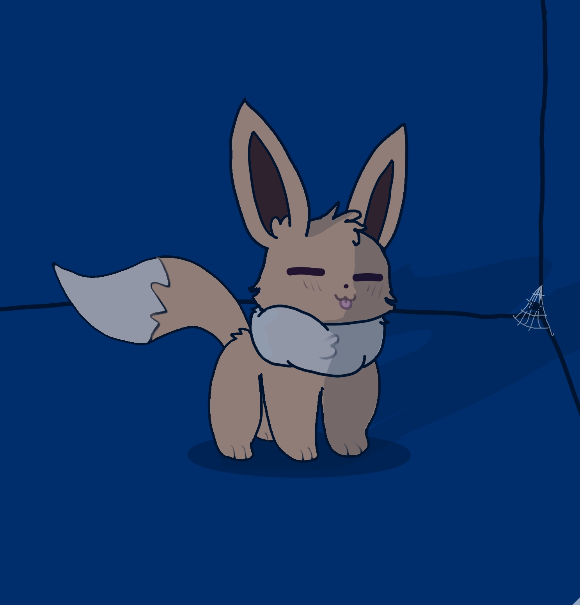

# Silent hill: The room 


**Жанр**: хоррор \
**Разработчик**: Артём \
**Описание**: Останьтесь в закрытой команате в полном одиночестве и познайте его страхи. \
**Системные требования(минимальные):**

|требование |характеристика                           |
|-          |-                                        |
|OS         |Windows XP/Vista/Windows 7/Windows 8     |
|Processor  |1.7+ GHz or better                       |
|Memory     |1+ gigs of RAM GB RAM                    |
|Graphics   |Radeon HD5450 or better; 256 MB or higher|
|DirectX®   |9.0c                                     |
|Hard Drive |500 MB HD space                          |
|Sound      |100% DirectX9.0c compatible sound card and drivers|

**Ключевые особенности:**
- Комната страшная 
- Есть кровать
- Нет отопления
- Есть дыра в стене для подглядывания

**О разработчике:**
Хочу отопление себе домой . Это идея посетила меня при разработке данной игры.

 \
 \

```python
print(Игра сделана на Python :) )
```
